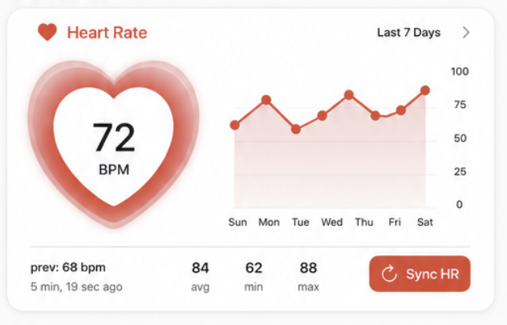

# Knockoff Watch Design Instructions

This document describes the next UI refinement for the Knockoff Watch home screen health cards.

Reference image:



## Goal

Refine the existing health reading cards without changing the overall app structure, navigation, BLE logic, HealthKit logic, or current light/dark adaptive styling.

The current color scheme and native iOS feel are good. Keep the design aligned with the existing app:

- System light/dark mode support
- Rounded iOS-style cards
- Metric-specific accent colors
- Clean spacing
- Large, readable health values
- Minimal visual noise

## Scope

This phase focuses only on the health reading cards on the Home screen.

Update the shared card layout used by:

- Heart Rate
- Blood Pressure
- Blood Oxygen

Do not change:

- Bluetooth connection logic
- BLE packet decoding
- HealthKit writes
- Auto Health Sync flow
- Settings screen
- Onboarding flow
- App navigation

## Current Issue

The cards are directionally good, but the current layout gives too much space to secondary stats and not enough space to the primary reading and weekly chart.

The primary reading should be the hero element.

For Heart Rate specifically:

- The heart icon should become much larger.
- The current BPM value should be centered inside the heart.
- `BPM` should appear underneath the number, still inside the heart area.
- The chart should take up much more room, roughly half the card width.
- Previous value, average, minimum, maximum, timestamp, and sync action should move into a bottom information/action bar.

## Shared Card Layout

Each metric card should have the same structural pattern:

```text
-------------------------------------------------
| Icon + Metric Title                     >      |
|-----------------------------------------------|
|                                               |
|   Large animated metric visual    7-day chart |
|   with current value centered     takes ~50%  |
|                                               |
|-----------------------------------------------|
| prev / updated     avg     min     max  button|
-------------------------------------------------
```

### Header

The header row should include:

- Metric icon
- Metric title
- Optional chevron for future detail screen

Metric titles:

- Heart Rate
- Blood Pressure
- Blood Oxygen

Accent colors:

- Heart Rate: red/pink system accent
- Blood Pressure: orange system accent
- Blood Oxygen: blue system accent

Use system-friendly colors that adapt to light and dark mode. Avoid hardcoded colors unless they already exist in the project.

## Main Content Area

The main content area should be split into two major zones.

### Left Zone: Primary Metric Visual

The left side should contain a large metric-specific visual.

#### Heart Rate

Show a large heart.

Inside the heart:

- Current BPM value, very large
- `BPM` underneath

Idle example:

```text
    ♥
   72
  BPM
```

Measuring example:

```text
    ♥
   --
  BPM
```

Complete example:

```text
    ♥
   85
  BPM
```

#### Blood Pressure

Use the same card structure, but with a pressure/cuff inspired visual.

Inside the visual:

- Current systolic/diastolic reading
- `mmHg` underneath

Example:

```text
118 / 76
  mmHg
```

#### Blood Oxygen

Use the same card structure, but with lungs or oxygen-inspired visual.

Inside the visual:

- Current SpO2 percentage
- `%` or `SpO2` underneath

Example:

```text
  98
   %
```

### Right Zone: Weekly Chart

The chart should occupy almost half the card width.

Chart title:

```text
Last 7 Days
```

Use daily points, not hourly points.

Default chart range:

```text
7D
```

Data behavior:

- One point per day
- Use the average or latest successful reading for that day
- If a day has no data, show a gap rather than inventing a point
- If fewer than seven days exist, show available points and empty days

Chart types:

- Heart Rate: single line
- Blood Pressure: two lines, systolic and diastolic
- Blood Oxygen: single line

Chart should be visually larger than the current implementation.

Avoid tiny charts that feel decorative. The chart should be useful.

## Bottom Information / Action Bar

Move secondary data into a compact bottom bar.

The bottom bar should include:

- Previous reading
- Time since update or timestamp
- Average
- Minimum
- Maximum
- Sync button

Example for Heart Rate:

```text
prev: 68 bpm     84 avg     62 min     88 max     Sync HR
5 min, 19 sec ago
```

Example for Blood Pressure:

```text
prev: 103/68     112/72 avg     103 min     120 max     Sync BP
5 min, 7 sec ago
```

Example for Blood Oxygen:

```text
prev: 97%        97% avg     96% min     98% max     Sync SpO2
4 min, 57 sec ago
```

Keep this readable, but subordinate to the main value and chart.

## Scan / Measurement States

Each metric card needs three clear states:

1. Idle
2. Measuring
3. Complete / Updated

These states must work whether the scan is triggered by:

- Sync All
- Individual Sync HR
- Individual Sync BP
- Individual Sync SpO2
- Auto Health Sync

## Idle State

In idle state:

- Show current reading in the large metric visual.
- Show previous reading in the bottom bar.
- Show chart using available weekly data.
- Sync button is enabled.

## Measuring State

When measurement starts:

- Move the current reading to the previous reading slot if needed.
- Blank the primary value in the metric visual.
- Show `--` where the current value would be.
- Show unit label underneath.
- Start metric-specific animation.
- Disable the card's sync button while measuring.
- Keep the chart visible.
- Show `Measuring...` in the bottom bar.

Important behavior:

The old value should not remain displayed as the current value while a new reading is actively being gathered.

## Complete State

When the measurement completes:

- Stop animation.
- Render the new value prominently in the metric visual.
- Update timestamp.
- Update previous value.
- Update chart.
- Re-enable sync button.
- Save to Apple Health using existing logic.

## Animations

Keep animations native SwiftUI and lightweight.

Do not add third-party animation libraries.

### Heart Rate Animation

During measurement:

- Heart gently pulses.
- Use scale and subtle glow/opacity changes.
- Optional heartbeat line may pulse inside or across the heart.
- Current value displays as `--`.

### Blood Pressure Animation

During measurement:

- Use pressure/cuff/ring visual.
- Ring can inflate or sweep around the visual.
- Current value displays as `-- / --`.

### Blood Oxygen Animation

During measurement:

- Lungs fill and empty.
- Use a gentle breathing animation.
- Current value displays as `--`.

## Component Design

Prefer a reusable card component with metric-specific configuration.

Suggested component names:

- `MetricReadingCard`
- `MetricHeroVisual`
- `HeartRateHeroVisual`
- `BloodPressureHeroVisual`
- `BloodOxygenHeroVisual`
- `WeeklyMetricChart`
- `MetricBottomBar`

Keep the common layout shared.

Allow metric-specific visuals and chart series.

## Suggested Data Model

If useful, introduce lightweight view models for the card layer only.

Example:

```swift
enum MetricKind {
    case heartRate
    case bloodPressure
    case bloodOxygen
}

enum MetricScanState {
    case idle
    case measuring
    case complete
}

struct MetricCardData {
    let kind: MetricKind
    let title: String
    let currentValue: String?
    let unit: String
    let previousValue: String?
    let updatedAt: Date?
    let average: String?
    let minimum: String?
    let maximum: String?
    let weeklyPoints: [MetricChartPoint]
    let scanState: MetricScanState
}
```

Do not replace the working BLE or HealthKit models unless necessary.

## Chart Requirements

Use Swift Charts if it is already available and appropriate.

If Swift Charts is not practical, use a simple SwiftUI `Path` based chart.

Requirements:

- Last 7 days by default
- Daily labels: Sun, Mon, Tue, Wed, Thu, Fri, Sat or localized equivalent
- Heart Rate y-axis should be sensible for BPM
- Blood Pressure should show systolic and diastolic
- Blood Oxygen y-axis should focus around 80 to 100
- Chart should adapt to light/dark mode
- Chart should not crowd the main value

## Preserve Current Style

Keep the existing app's current style direction:

- Light mode and dark mode should both look good.
- Use system materials/colors where possible.
- Do not introduce a full custom dark-only theme.
- Do not drastically alter the top watch connection area.
- Do not redesign the Settings screen in this phase.

## Accessibility

Support:

- Dynamic Type as much as practical
- VoiceOver labels
- Large readable values

VoiceOver examples:

- `Heart Rate, 72 beats per minute, updated 5 minutes ago`
- `Blood Pressure, 118 over 76 millimeters of mercury`
- `Blood Oxygen, 98 percent`

## Implementation Guardrails

Do not modify:

- BLE command constants
- BLE packet decoding
- HealthKit permissions
- HealthKit save methods
- Watch pairing logic
- Background sync scheduler

Only modify UI and UI-facing state mapping unless absolutely necessary.

## Acceptance Criteria

- Each health metric appears as its own richer card.
- The primary reading is large and easy to read.
- Heart Rate displays the BPM centered inside a large heart.
- Blood Pressure and Blood Oxygen follow the same card layout with their own visuals.
- The chart takes up roughly half the card width.
- The chart shows seven days of daily data.
- Secondary stats live in the bottom bar.
- During measurement, current value blanks out and animation runs.
- On completion, new value appears and chart updates.
- Individual sync and Sync All both trigger the relevant card animations.
- Existing BLE and HealthKit behavior remains working.
- Existing system light/dark adaptive design remains intact.